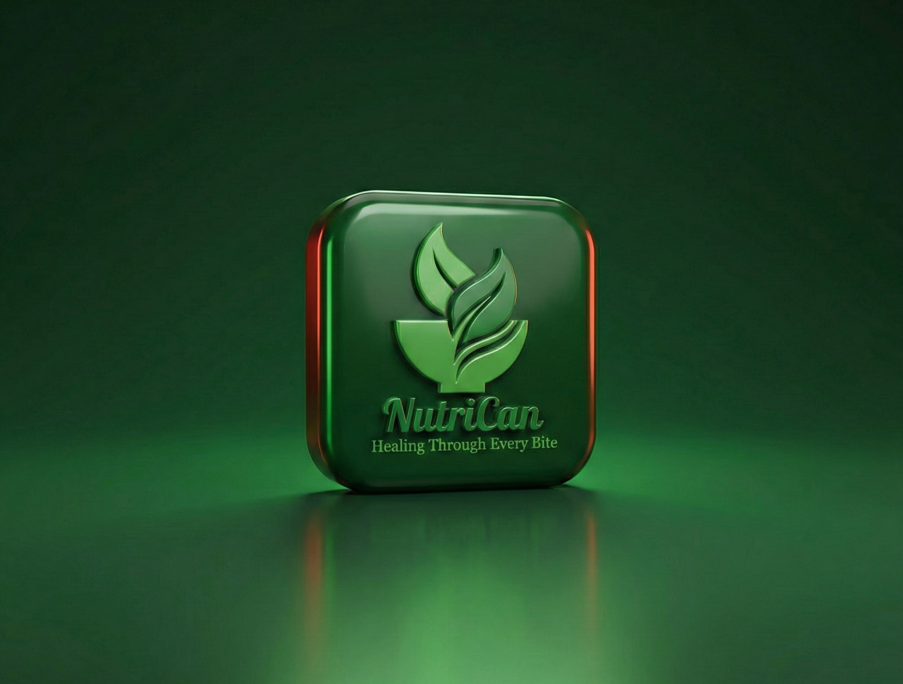

<div align="center">

  

  <br />
  <br />

  <p>
    <a href="https://github.com/balirwaalvin/NutriCan-Mobile/stargazers"></a>
    <a href="https://github.com/balirwaalvin/NutriCan-Mobile/network/members"></a>
    <a href="https://github.com/balirwaalvin/NutriCan-Mobile/blob/main/LICENSE"></a>
    <a href="https://github.com/balirwaalvin/NutriCan-Mobile/issues"></a>
  </p>

  <p>
    
    
    
    
    
    
  </p>

  <h3>
    <em>Empowering cervical cancer patients with AI-driven nutrition, wellness tracking, and specialist-level guidance — all in the palm of their hand.</em>
  </h3>

  <br />

  <a href="#-getting-started"><strong>Get Started →</strong></a>
  &nbsp;&bull;&nbsp;
  <a href="#-features"><strong>Features</strong></a>
  &nbsp;&bull;&nbsp;
  <a href="#-api-reference"><strong>API Docs</strong></a>
  &nbsp;&bull;&nbsp;
  <a href="#-deployment"><strong>Deploy</strong></a>

</div>

<br />

---

## Why NutriCan?

Cancer treatment is hard enough. Knowing *what to eat* shouldn't be.

**NutriCan** is a mobile-first wellness companion built specifically for cervical cancer patients and survivors. Every feature is designed with one purpose: to give patients the nutritional knowledge, daily structure, and specialist guidance that their bodies need during one of the most challenging periods of their lives.

Powered by **Google Gemini AI**, NutriCan doesn't offer generic advice — it understands your diagnosis, treatment phase, and personal health profile to deliver hyper-personalised recommendations that actually matter.

---

## ✨ Features

<table>
  <tr>
    <td width="50%">
      <h4>🧬 Personalised Onboarding</h4>
      <p>Captures cancer type, stage, treatment phase, and comorbidities on first launch. Every AI recommendation is calibrated to this unique profile — nothing generic, nothing irrelevant.</p>
    </td>
    <td width="50%">
      <h4>🍽️ AI-Generated Meal Plans</h4>
      <p>Gemini AI crafts a full <strong>7-day meal plan</strong> tailored to your condition, treatment side effects, and nutritional goals. Breakfast, lunch, dinner, and snacks — all covered.</p>
    </td>
  </tr>
  <tr>
    <td>
      <h4>🔍 Food Safety Checker</h4>
      <p>Type or scan any food and receive an instant <strong>Safe / Limit / Avoid</strong> verdict with evidence-based clinical reasoning. Know exactly what's on your plate before you eat it.</p>
    </td>
    <td>
      <h4>📊 Barcode & Nutrient Scanner</h4>
      <p>Log meals and automatically track daily <strong>calorie, sugar, and salt</strong> intake. Visual summaries keep you informed without overwhelming you.</p>
    </td>
  </tr>
  <tr>
    <td>
      <h4>📓 Health Journal</h4>
      <p>Daily logging of weight, blood pressure, energy levels, and personal notes. All data is rendered as <strong>interactive charts</strong> powered by Recharts so you can see your journey at a glance.</p>
    </td>
    <td>
      <h4>👨‍⚕️ Doctor Connect</h4>
      <p>AI-simulated consultations with an <strong>oncologist, dietitian, or psychologist</strong>. Get thoughtful, contextual answers any time — no waiting room required.</p>
    </td>
  </tr>
  <tr>
    <td>
      <h4>📚 Symptom Library</h4>
      <p>Browse evidence-backed food recommendations for common treatment side effects — nausea, fatigue, mouth sores, and more. Knowledge is the first step to relief.</p>
    </td>
    <td>
      <h4>📎 Document Upload</h4>
      <p>Securely upload medical PDFs (lab reports, prescriptions, scan results) to a <strong>private DigitalOcean Space</strong>. Documents are protected behind short-lived signed URLs.</p>
    </td>
  </tr>
  <tr>
    <td>
      <h4>⭐ Free & Premium Plans</h4>
      <p>A generous free tier for everyone, with a <strong>Premium upgrade</strong> that unlocks advanced AI features and unlimited history.</p>
    </td>
    <td>
      <h4>🌙 Dark / Light Mode + Guest Mode</h4>
      <p>Full theme support for both modes. Don't want to create an account yet? <strong>Guest mode</strong> lets you explore the entire app before committing.</p>
    </td>
  </tr>
</table>

---

## 🛠️ Tech Stack

```
┌─────────────────────────────────────────────────────────┐
│                       FRONTEND                          │
│  React 18 · TypeScript 5 · Vite · Recharts             │
│  Google Gemini AI (@google/genai)                       │
├─────────────────────────────────────────────────────────┤
│                       BACKEND                           │
│  Node.js · Express · MongoDB Atlas · Mongoose           │
│  JWT Authentication · bcryptjs · Multer                 │
│  DigitalOcean Spaces (S3-compatible)                    │
└─────────────────────────────────────────────────────────┘
```

| Layer | Technology | Purpose |
|---|---|---|
| UI Framework | React 18 + TypeScript | Component-based, type-safe frontend |
| Build Tool | Vite | Lightning-fast HMR and production builds |
| Charts | Recharts | Health journal visualisations |
| AI Engine | Google Gemini AI | Meal plans, food safety, doctor chat |
| API Server | Node.js + Express | RESTful backend |
| Database | MongoDB Atlas + Mongoose | Persistent data with schema validation |
| Auth | JWT + bcryptjs | Stateless auth with secure password hashing |
| File Storage | DigitalOcean Spaces | HIPAA-friendly private document storage |

---

## 📁 Project Structure

```
NutriCan-Mobile/
│
├── 📂 components/
│   ├── AuthScreen.tsx        ← Sign up · Sign in · Guest login
│   ├── Dashboard.tsx         ← Full app shell (all dashboard pages)
│   ├── SplashScreen.tsx      ← Animated entry screen
│   ├── OnboardingScreen.tsx  ← Patient health profile collection
│   ├── TermsScreen.tsx       ← Terms & conditions
│   └── Icons.tsx             ← SVG icon library
│
├── 📂 contexts/
│   └── ThemeContext.tsx      ← Dark / light mode provider
│
├── 📂 services/
│   ├── db.ts                 ← REST API client layer
│   ├── config.ts             ← API base URL configuration
│   └── geminiService.ts      ← All Gemini AI call wrappers
│
├── 📂 public/
│   └── NutriCan-README.png   ← Project banner image
│
├── types.ts                  ← Shared TypeScript type definitions
├── App.tsx                   ← Top-level router
└── .env.example              ← Frontend environment template
│
└── 📂 backend/
    ├── server.js             ← Express entry point
    ├── 📂 db/
    │   ├── connection.js     ← MongoDB connection + index setup
    │   └── seed.js           ← Dev seed script
    ├── 📂 middleware/
    │   └── auth.js           ← JWT verification middleware
    ├── 📂 models/
    │   ├── User.js
    │   ├── JournalEntry.js
    │   ├── Meal.js
    │   └── Document.js
    ├── 📂 routes/
    │   ├── auth.js           ← POST /signup · /signin · /guest · GET /me
    │   ├── profile.js        ← GET/PATCH /profile · POST /upgrade
    │   ├── journal.js        ← GET/POST /journal
    │   ├── meals.js          ← GET/POST /meals
    │   └── documents.js      ← POST /upload · GET /documents
    └── package.json
```

---

## 🚀 Getting Started

### Prerequisites

Before you begin, ensure you have the following:

- **[Node.js](https://nodejs.org/) v18+**
- A **[MongoDB Atlas](https://cloud.mongodb.com)** account — free tier is more than enough
- A **[Google Gemini API key](https://aistudio.google.com/app/apikey)** — free at Google AI Studio
- *(Optional)* A **[DigitalOcean Space](https://cloud.digitalocean.com/spaces)** for medical document uploads

---

### Step 1 — Clone the Repository

```bash
git clone https://github.com/balirwaalvin/NutriCan-Mobile.git
cd NutriCan-Mobile
```

### Step 2 — Install Dependencies

```bash
# Install frontend dependencies
npm install

# Install backend dependencies
cd backend && npm install && cd ..
```

### Step 3 — Configure Environment Variables

**Frontend** — create `.env` in the project root:

```bash
cp .env.example .env
```

```env
VITE_API_URL=http://localhost:4000
VITE_API_KEY=your_gemini_api_key_here
```

**Backend** — create `backend/.env`:

```bash
cp backend/.env.example backend/.env
```

```env
# ── Database ──────────────────────────────────────────────
MONGODB_URI=mongodb+srv://<user>:<password>@cluster.mongodb.net/nutrican?retryWrites=true&w=majority

# ── Authentication ────────────────────────────────────────
JWT_SECRET=your_super_secret_key_here    # Use a long random string
JWT_EXPIRES_IN=7d

# ── DigitalOcean Spaces (optional) ───────────────────────
DO_SPACES_ENDPOINT=https://nyc3.digitaloceanspaces.com
DO_SPACES_REGION=nyc3
DO_SPACES_BUCKET=your-space-name
DO_SPACES_KEY=your-access-key
DO_SPACES_SECRET=your-secret-key

# ── Server ────────────────────────────────────────────────
PORT=4000
ALLOWED_ORIGINS=http://localhost:5173
NODE_ENV=development
```

> **MongoDB Atlas tip:** Navigate to **Security → Network Access** and whitelist your IP address (or `0.0.0.0/0` for local development).

### Step 4 — Run the App

```bash
npm run dev
```

One command spins up both servers simultaneously:

| Server | URL | Description |
|---|---|---|
| 🌐 Frontend | `http://localhost:5173` | Vite dev server with HMR |
| ⚙️ Backend | `http://localhost:4000` | Express REST API |

---

## 📡 API Reference

All endpoints are prefixed with `/api`.

### 🔐 Auth — `/api/auth`

| Method | Endpoint | Description | Auth |
|:---:|---|---|:---:|
| `POST` | `/signup` | Register a new user | ✗ |
| `POST` | `/signin` | Sign in and receive a JWT | ✗ |
| `POST` | `/guest` | Create a temporary guest session | ✗ |
| `GET` | `/me` | Validate token and return profile | ✓ |

### 👤 Profile — `/api/profile`

| Method | Endpoint | Description | Auth |
|:---:|---|---|:---:|
| `GET` | `/` | Retrieve current user profile | ✓ |
| `PATCH` | `/` | Update profile fields | ✓ |
| `POST` | `/upgrade` | Upgrade to Premium plan | ✓ |

### 📓 Journal — `/api/journal`

| Method | Endpoint | Description | Auth |
|:---:|---|---|:---:|
| `GET` | `/` | Fetch last 30 journal entries | ✓ |
| `POST` | `/` | Submit a new entry (weight, energy, bp, notes) | ✓ |

### 🍽️ Meals — `/api/meals`

| Method | Endpoint | Description | Auth |
|:---:|---|---|:---:|
| `GET` | `/` | Retrieve last 50 meal logs | ✓ |
| `POST` | `/` | Log a meal with nutrient data | ✓ |

### 📎 Documents — `/api/documents`

| Method | Endpoint | Description | Auth |
|:---:|---|---|:---:|
| `POST` | `/upload` | Upload a PDF to DigitalOcean Spaces | ✓ |
| `GET` | `/` | List documents with signed download URLs | ✓ |

### ❤️ Health Check

```http
GET /health
```

```json
{
  "status": "ok",
  "db": {
    "status": "connected",
    "host": "cluster0.mongodb.net",
    "db": "nutrican",
    "readyState": 1
  }
}
```

---

## 🧰 Available Scripts

**From the project root:**

```bash
npm run dev             # ▶  Start frontend + backend together
npm run dev:frontend    # ▶  Vite dev server only
npm run dev:backend     # ▶  Express server only
npm run build           # 📦  Production build (outputs to dist/)
```

**From the `backend/` directory:**

```bash
npm run dev    # ▶  Start with nodemon (auto-restart on changes)
npm run start  # ▶  Start server (production mode)
npm run seed   # 🌱  Seed database with demo data
```

---

## 🌱 Seed Data (Development)

Quickly populate the database with a demo user and sample records:

```bash
cd backend
npm run seed
```

Login with the seeded demo account:

```
Email:     demo@nutrican.app
Password:  password123
```

---

## ☁️ Deployment

### Frontend

Build and deploy the `dist/` folder to any static host:

| Platform | Notes |
|---|---|
| **[Vercel](https://vercel.com)** | Recommended — connect your GitHub repo and add `VITE_API_URL` as an env var |
| **[Netlify](https://netlify.com)** | Drag-and-drop or Git-connected deployments |
| **[GitHub Pages](https://pages.github.com)** | Free static hosting via GitHub Actions |

### Backend

Deploy the `backend/` folder to a Node.js-compatible host:

| Platform | Notes |
|---|---|
| **[Railway](https://railway.app)** | Recommended — free tier, automatic deploys from GitHub |
| **[Render](https://render.com)** | Free tier with sleep on inactivity |
| **VPS** | DigitalOcean Droplet, AWS EC2, or any Linux server with Node.js |

> Set all variables from `backend/.env.example` in your hosting platform's environment settings before deploying.

---

## 🔒 Security

NutriCan takes patient data seriously:

- **`.env` files are git-ignored** — secrets never leave your machine
- **JWT-based auth** — stateless, short-lived tokens sent via `Authorization: Bearer`
- **bcryptjs password hashing** — 12 salt rounds, passwords never stored in plaintext and never returned in API responses
- **Private document storage** — medical files live in a private DigitalOcean Space; download links are **signed URLs that expire in 15 minutes**
- **CORS control** — only whitelisted origins can reach the backend

---

## 🤝 Contributing

Contributions are warmly welcome. If you'd like to improve NutriCan:

1. Fork the repository
2. Create a feature branch: `git checkout -b feature/your-feature-name`
3. Commit your changes: `git commit -m "feat: add your feature"`
4. Push to your branch: `git push origin feature/your-feature-name`
5. Open a Pull Request

Please open an issue first for major changes so we can discuss the approach.

---

## 📄 License

This project is licensed under the **MIT License** — see the [LICENSE](LICENSE) file for details.

---

<div align="center">

  <p>Built with ❤️ for patients who deserve better tools on their healing journey.</p>

  <p>
    <a href="https://github.com/balirwaalvin">
      
    </a>
  </p>

  <p>
    <a href="https://github.com/balirwaalvin/NutriCan-Mobile">⭐ Star this repo if NutriCan inspired you</a>
  </p>

</div>
